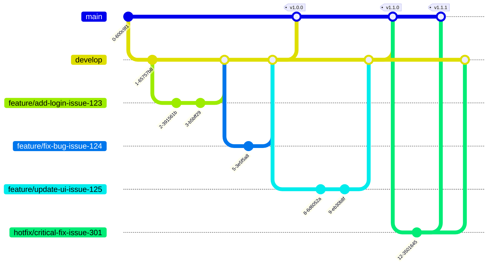

# Git strategy (Git-flow without release branch)

```mermaid
---
<!-- title: Git strategy (Git-flow without release branch) -->
---

gitGraph
commit
branch develop
checkout develop
commit

branch feature/add-login-issue-123
checkout feature/add-login-issue-123
commit
commit
checkout develop
merge feature/add-login-issue-123

branch feature/fix-bug-issue-124
checkout feature/fix-bug-issue-124
commit
checkout develop
merge feature/fix-bug-issue-124

checkout main
merge develop tag: "v1.0.0"

checkout develop
branch feature/update-ui-issue-125
checkout feature/update-ui-issue-125
commit
commit
checkout develop
merge feature/update-ui-issue-125

checkout main
merge develop tag: "v1.1.0"

checkout main
branch hotfix/critical-fix-issue-301
checkout hotfix/critical-fix-issue-301
commit
checkout main
merge hotfix/critical-fix-issue-301 tag: "v1.1.1"
checkout develop
merge hotfix/critical-fix-issue-301
```
